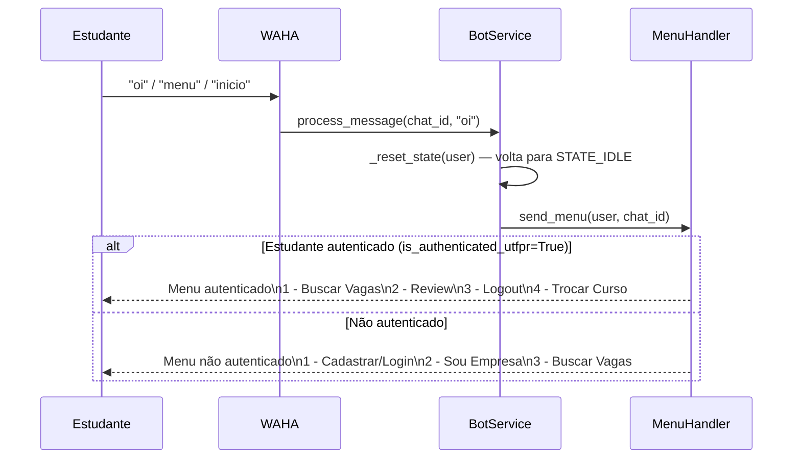
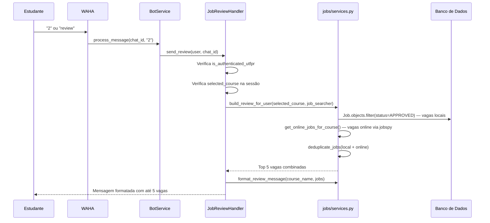
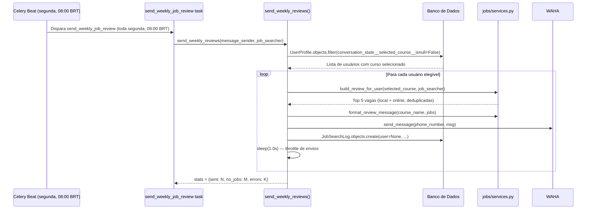
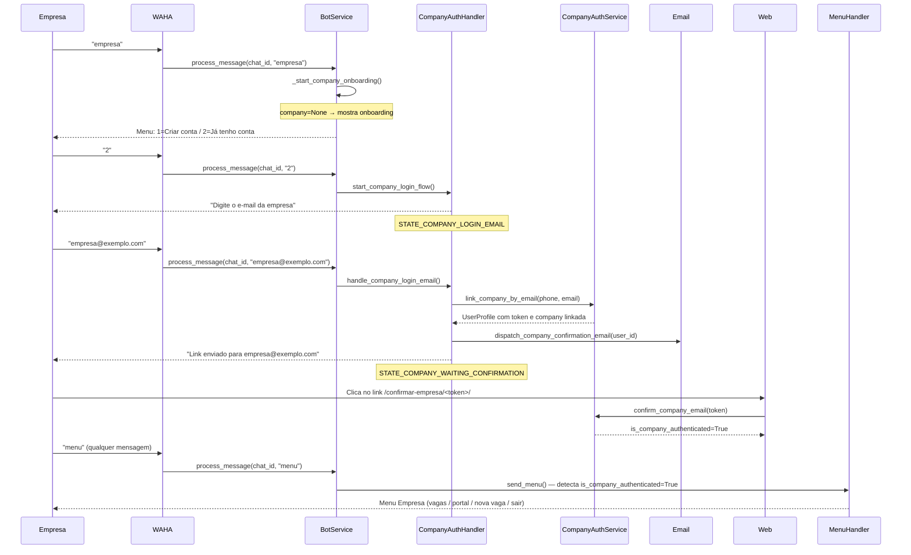
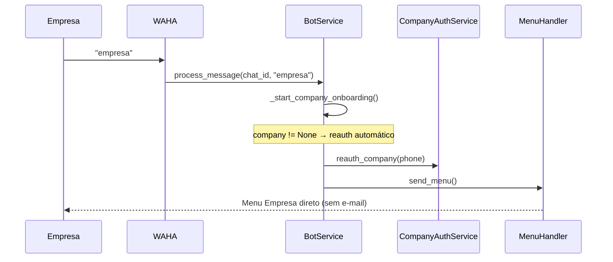
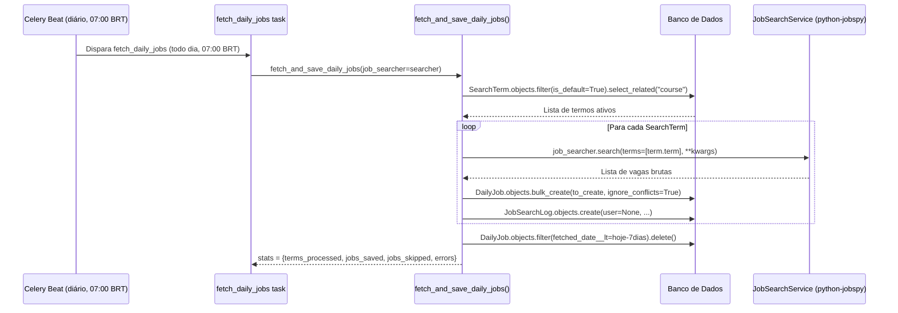

# Fluxos do Bot — IterBot UTFPR

## Visão Geral

`BotService.process_message()` é o entry point de todas as mensagens recebidas via webhook. Ele recebe `chat_id`, `message` e `from_me`, descarta mensagens próprias, cria ou busca o `UserProfile` pelo número de telefone, e roteia a mensagem para o handler correto com base no texto recebido e no estado atual da conversa.

Referência principal: `apps/bot/services.py:BotService`

---

## 1. Fluxo de Autenticação por E-mail

Estudantes que ainda não têm `is_authenticated_utfpr=True` precisam passar por este fluxo antes de acessar busca de vagas ou review.

### Diagrama

```mermaid
sequenceDiagram
    participant Estudante
    participant WAHA
    participant Webhook
    participant BotService
    participant AuthHandler as AuthenticationHandler
    participant UTFPRAuth as UTFPRAuthService
    participant Email as EmailDispatcher
    participant ConfirmView as ConfirmEmailView (web)

    Estudante->>WAHA: "cadastrar" / "1"
    WAHA->>Webhook: POST /webhook/
    Webhook->>BotService: process_message(chat_id, "cadastrar")
    BotService->>AuthHandler: start_login_flow(user, chat_id)
    AuthHandler-->>Estudante: Solicita RA

    Estudante->>WAHA: "123456"
    WAHA->>BotService: process_message(chat_id, "123456")
    BotService->>AuthHandler: handle_login_ra(user, chat_id, "123456")
    AuthHandler-->>Estudante: Solicita senha

    Estudante->>WAHA: "minha_senha"
    WAHA->>BotService: process_message(chat_id, "minha_senha")
    BotService->>AuthHandler: handle_login_password(user, chat_id, "minha_senha")
    AuthHandler->>UTFPRAuth: authenticate(ra, password)
    UTFPRAuth-->>AuthHandler: True (credenciais válidas)
    AuthHandler-->>Estudante: Solicita e-mail @alunos.utfpr.edu.br

    Estudante->>WAHA: "aluno@alunos.utfpr.edu.br"
    WAHA->>BotService: process_message(chat_id, "aluno@alunos.utfpr.edu.br")
    BotService->>AuthHandler: handle_login_email(user, chat_id, email)
    AuthHandler->>UTFPRAuth: link_user(chat_id, ra, password, email)
    UTFPRAuth-->>AuthHandler: UserProfile criado/atualizado
    AuthHandler->>Email: dispatch_confirmation_email(user_id)
    AuthHandler-->>Estudante: "Aguardando confirmação — verifique seu e-mail"

    Estudante->>ConfirmView: Clica no link do e-mail
    ConfirmView-->>Estudante: is_authenticated_utfpr=True; acesso liberado
```

### Passos

1. Estudante envia "cadastrar", "login", "entrar" ou "1" (menu não autenticado) — `apps/bot/services.py:_handle_text_alias()` linha 166 / `_handle_numeric_unauthenticated()` linha 203
2. `BotService` chama `AuthenticationHandler.start_login_flow()` — `apps/bot/handlers/authentication.py:L44`
3. Handler verifica `user.is_authenticated_utfpr`; se já autenticado, informa o usuário e retorna — `apps/bot/handlers/authentication.py:L45`
4. Handler aplica transição para `STATE_LOGIN_STEP_RA` e solicita o RA — `apps/bot/handlers/authentication.py:L61`
5. Próxima mensagem entra em `handle()` → `handle_login_ra()` — `apps/bot/handlers/authentication.py:L76`; RA é validado (mínimo 5 chars) e salvo em `flow_data["temp_ra"]`
6. Estado avança para `STATE_LOGIN_STEP_PASSWORD`; estudante envia senha — `apps/bot/handlers/authentication.py:L107`
7. `handle_login_password()` chama `UTFPRAuthService.authenticate(ra, password)` — `apps/users/services.py`; se falhar, informa erro e permanece no estado
8. Se credenciais válidas e e-mail já verificado anteriormente → re-login direto, estado volta para `STATE_IDLE` — `apps/bot/handlers/authentication.py:L138`
9. Para primeiro cadastro: estado avança para `STATE_LOGIN_STEP_EMAIL`; estudante envia e-mail — `apps/bot/handlers/authentication.py:L164`
10. `handle_login_email()` valida o domínio `@alunos.utfpr.edu.br` via `validate_utfpr_email()` — `apps/bot/handlers/authentication.py:L191`
11. Chama `link_user()` para criar/associar o `UserProfile` — `apps/bot/handlers/authentication.py:L234`
12. Estado avança para `STATE_LOGIN_STEP_WAITING_CONFIRMATION`; `dispatch_confirmation_email()` envia link — `apps/bot/handlers/authentication.py:L259`
13. Estudante clica no link; `ConfirmEmailView` seta `email_verified=True` e `is_authenticated_utfpr=True` — `apps/users/views.py`

**Re-login:** Qualquer mensagem enquanto em `STATE_LOGIN_STEP_WAITING_CONFIRMATION` é tratada por `handle_login_waiting_confirmation()` — `apps/bot/handlers/authentication.py:L284`. O estudante pode digitar "reenviar" para receber o e-mail novamente.

---

## 2. Fluxo do Menu Principal

Disparado por qualquer saudação ("oi", "menu", "inicio") ou por um comando não reconhecido no fluxo atual.

### Diagrama



### Passos

1. `BotService.process_message()` detecta saudação no conjunto de palavras-chave — `apps/bot/services.py:L80`
2. `_reset_state(user)` aplica transição para `STATE_IDLE` e limpa `flow_data` — `apps/bot/services.py:L266`
3. `MenuHandler.send_menu()` verifica `user.is_authenticated_utfpr` — `apps/bot/handlers/menu.py:L21`
4. Se autenticado: envia menu com opções 1=Buscar, 2=Review, 3=Logout, 4=Trocar Curso — `apps/bot/handlers/menu.py:L23`
5. Se não autenticado: envia menu com opções 1=Cadastrar/Login, 2=Empresa, 3=Buscar (com gate de autenticação) — `apps/bot/handlers/menu.py:L29`
6. Comandos de texto "cancelar" ou "voltar" também resetam o estado e exibem o menu — `apps/bot/services.py:L95`
7. "sair" realiza logout completo antes de resetar — `apps/bot/services.py:L96`
8. Comando não reconhecido aciona `send_unknown_command()` — `apps/bot/handlers/menu.py:L84`

**Roteamento de fluxos ativos:** Se `has_active_flow(current_action)` for True, `_handle_pending_action()` despacha para `auth_handler.handle()` ou `job_handler.handle()` antes de chegar ao menu — `apps/bot/services.py:L110`

---

## 3. Fluxo de Busca de Vagas

Acesso via opção "1" (menu autenticado) ou alias "vagas", "buscar", "cursos".

### Diagrama

```mermaid
sequenceDiagram
    participant Estudante
    participant WAHA
    participant BotService
    participant JobHandler as JobSearchHandler
    participant DB as Banco de Dados

    Estudante->>WAHA: "1" ou "vagas"
    WAHA->>BotService: process_message(chat_id, "1")
    BotService->>JobHandler: start_course_selection(user, chat_id)

    alt user.course já salvo (preferência persistente)
        JobHandler->>JobHandler: Sincroniza selected_course com user.course
        JobHandler->>JobHandler: start_term_selection(user, chat_id)
        JobHandler-->>Estudante: Lista de termos de busca do curso
    else Primeiro acesso ou sem preferência salva
        JobHandler->>DB: Course.objects.filter(is_active=True)
        JobHandler-->>Estudante: Lista de cursos ativos
        Estudante->>WAHA: "2" (seleciona curso)
        WAHA->>BotService: process_message(chat_id, "2")
        BotService->>JobHandler: handle_course_selection(user, chat_id, "2")
        JobHandler->>DB: user.course = courses[1]; user.save()
        JobHandler-->>Estudante: "Preferência salva: [Curso]"
        JobHandler->>JobHandler: start_term_selection(user, chat_id)
        JobHandler-->>Estudante: Lista de termos de busca do curso
    end

    Estudante->>WAHA: "1" (seleciona termo)
    WAHA->>BotService: process_message(chat_id, "1")
    BotService->>JobHandler: handle_term_selection(user, chat_id, "1")
    JobHandler->>JobHandler: perform_search(user, chat_id, [term], term_name)
    JobHandler->>DB: DailyJob.objects.filter(search_term__in=terms, fetched_date=hoje)
    DB-->>JobHandler: Lista de vagas pré-fetched
    JobHandler-->>Estudante: Vagas formatadas (máx. 5 por termo)
```

### Passos

1. `start_course_selection()` verifica autenticação; não autenticado recebe mensagem de bloqueio — `apps/bot/handlers/job_search.py:L48`
2. Se `user.course is not None` (preferência salva): sincroniza `selected_course` na sessão e pula direto para `start_term_selection()` — `apps/bot/handlers/job_search.py:L61`
3. Sem preferência: consulta `Course.objects.filter(is_active=True)` e exibe menu numerado — `apps/bot/handlers/job_search.py:L74`
4. Estado avança para `STATE_COURSE_SELECTION` — `apps/bot/handlers/job_search.py:L93`
5. Próxima mensagem: `handle_course_selection()` valida índice, salva `user.course` via `user.save(update_fields=["course"])` — `apps/bot/handlers/job_search.py:L153` e `L183`
6. `is_first_time` detectado **antes** do save — `apps/bot/handlers/job_search.py:L179`; na 1ª vez exibe mensagem de "preferência salva", nas trocas exibe "preferência atualizada"
7. `start_term_selection()` busca `SearchTerm.objects.filter(is_default=True)` associados ao curso — `apps/bot/handlers/job_search.py:L220`
8. Estado avança para `STATE_TERM_SELECTION`; estudante escolhe o termo
9. `handle_term_selection()` salva `selected_term` e chama `perform_search()` — `apps/bot/handlers/job_search.py:L270` e `L318`
10. `perform_search()` consulta `DailyJob.objects.filter(search_term__in=search_terms, fetched_date=hoje)` — NÃO chama jobspy diretamente (elimina timeout silencioso, BOT-03) — `apps/bot/handlers/job_search.py:L325`
11. Fallback automático: se não há vagas hoje, busca a data mais recente disponível — `apps/bot/handlers/job_search.py:L363`
12. Cria `JobSearchLog` por SearchTerm para rastreabilidade — `apps/bot/handlers/job_search.py:L370`
13. Retorna até `BOT_RESULTS_PER_TERM = 5` vagas por termo formatadas com título, empresa e link — `apps/bot/handlers/job_search.py:L323`

**DailyJob** é populado diariamente às 07:00 pela task `fetch_daily_jobs` — ver Seção 5.

---

## 4. Fluxo de Review de Vagas (Sob Demanda)

Acesso via opção "2" (menu autenticado) ou aliases "review", "vagas da semana".

### Diagrama



### Passos

1. `send_review()` verifica `user.is_authenticated_utfpr`; bloqueia se não autenticado — `apps/bot/handlers/job_review.py:L27`
2. Verifica `selected_course` na sessão; se ausente, solicita que o estudante faça uma busca primeiro — `apps/bot/handlers/job_review.py:L43`
3. Envia mensagem de "buscando review..." e chama `build_review_for_user(selected_course, job_searcher)` — `apps/bot/handlers/job_review.py:L65`
4. `build_review_for_user()` combina vagas locais aprovadas (`get_local_jobs_for_course()`) com vagas online (`get_online_jobs_for_course()`) — `apps/jobs/services.py:L125`
5. `get_local_jobs_for_course()` filtra `Job.objects.filter(status=JobStatus.APPROVED)` pelos termos de busca do curso — `apps/jobs/services.py:L19`
6. `get_online_jobs_for_course()` chama jobspy via `search_with_config()` para busca online em tempo real — `apps/jobs/services.py:L103`
7. `deduplicate_jobs()` remove duplicatas por (título normalizado, empresa) — `apps/jobs/services.py:L111`
8. Retorna os 5 primeiros resultados combinados — `apps/jobs/services.py:L130`
9. `format_review_message()` formata a mensagem com cabeçalho, lista numerada e rodapé — `apps/jobs/services.py:L202`
10. Mensagem enviada via WAHA ao estudante — `apps/bot/handlers/job_review.py:L101`

**Nota:** Review sob demanda usa jobspy em tempo real (diferente da busca via DailyJob). Pode ser mais lento para cursos com muitos termos.

---

## 5. Task de Review Semanal Automático

Executada toda segunda-feira às 08:00 (horário de Brasília) via Celery Beat. Não requer interação do estudante.

### Diagrama



### Passos

1. Celery Beat dispara `send_weekly_job_review` toda segunda às 08:00 BRT — `waha_bot/settings/celery.py:L23` (`crontab(hour=8, minute=0, day_of_week="monday")`)
2. Task thin instancia `WahaClient` e `JobSearchService` e delega para `send_weekly_reviews()` — `apps/jobs/tasks.py:L9`
3. `send_weekly_reviews()` filtra `UserProfile` com `selected_course` não nulo na sessão — `apps/jobs/services.py:L238`
4. Para cada usuário: chama `build_review_for_user()` — mesma lógica do review sob demanda — `apps/jobs/services.py:L254`
5. Se nenhuma vaga encontrada: incrementa `stats["no_jobs"]` e pula o usuário — `apps/jobs/services.py:L255`
6. Formata e envia a mensagem via WAHA — `apps/jobs/services.py:L264`
7. Cria `JobSearchLog` com `user=None` para rastreabilidade do envio em lote — `apps/jobs/services.py:L266`
8. Aguarda 1 segundo entre envios para não sobrecarregar o WAHA — `apps/jobs/services.py:L283`
9. Retorna dicionário com estatísticas `{sent, no_jobs, errors}` — `apps/jobs/services.py:L296`

---

## 6. Fluxo de Autenticação de Empresa via WhatsApp

Empresas cadastradas no portal podem vincular seu número WhatsApp à conta do portal. Após o vínculo, o bot exibe um menu próprio de empresa (leitura).

### Diagrama — Primeiro Login



### Diagrama — Re-login (empresa já vinculada)



### Menu Empresa (opções)

| Opção | Ação |
|-------|------|
| 1 | Ver vagas cadastradas (leitura — `Job.objects.filter(company=...)`) |
| 2 | Link portal da empresa (`/empresas/perfil/`) |
| 3 | Link para cadastrar nova vaga (`/empresas/vagas/nova/`) |
| 0 | Sair da conta empresa (`is_company_authenticated=False`) |

### Switch entre modos (aluno + empresa no mesmo número)

- Usuário com ambas as contas autenticadas: empresa tem prioridade no menu.
- Digitar `aluno` → `_handle_switch_to_student()` → desloga empresa temporariamente → mostra menu aluno.
- Digitar `empresa` em modo aluno → re-autentica empresa → mostra menu empresa.
- Opção `5` no menu aluno aparece quando `user.company is not None`.

### Passos (primeiro login)

1. "empresa" → `_start_company_onboarding()` verifica `is_company_authenticated` e `company` — `apps/bot/services.py`
2. Se não vinculado: `STATE_COMPANY_ONBOARDING_SELECTION` → exibe opções — `apps/bot/handlers/menu.py:send_company_onboarding_menu()`
3. "2" (já tenho conta) → `CompanyAuthHandler.start_company_login_flow()` — `apps/bot/handlers/company_auth.py:L33`; avança para `STATE_COMPANY_LOGIN_EMAIL`
4. Empresa digita e-mail → `handle_company_login_email()` chama `CompanyAuthService.link_company_by_email()` — `apps/companies/company_auth_service.py:L17`
5. Token gerado → `UserProfile.company` setado (pending) + `company_confirmation_token` gerado
6. Email enviado via `dispatch_company_confirmation_email()` → task Celery `send_company_confirmation_email` — `apps/bot/tasks.py`
7. Estado avança para `STATE_COMPANY_WAITING_CONFIRMATION`
8. Empresa clica link `/confirmar-empresa/<token>/` → `ConfirmCompanyEmailView` → `CompanyAuthService.confirm_company_email()` seta `is_company_authenticated=True` — `apps/users/views.py`
9. Próxima mensagem → `send_menu()` detecta `is_company_authenticated=True` → menu empresa

---

## 7. Task de Pré-fetching Diário de Vagas

Executada todos os dias às 07:00 (horário de Brasília). Popula a tabela `DailyJob` para consulta sub-segundo pelo bot.

### Diagrama



### Passos

1. Celery Beat dispara `fetch_daily_jobs` todo dia às 07:00 BRT — `waha_bot/settings/celery.py:L29` (`crontab(hour=7, minute=0)`)
2. Task thin instancia `JobSearchService` e delega para `fetch_and_save_daily_jobs()` — `apps/jobs/tasks.py:L26`
3. `fetch_and_save_daily_jobs()` busca todos os `SearchTerm.objects.filter(is_default=True)` com `select_related("course")` — `apps/jobs/services.py:L145`
4. Para cada termo: chama `job_searcher.search()` usando `term.to_search_kwargs()` como configuração (LinkedIn, Indeed, Glassdoor) — `apps/jobs/services.py:L154`
5. Resultados salvos via `DailyJob.objects.bulk_create(to_create, ignore_conflicts=True)` — idempotente por `unique_together` — `apps/jobs/services.py:L171`
6. Apenas resultados com URL válida são persistidos: `if r.get("job_url") or r.get("job_url_direct")` — `apps/jobs/services.py:L168`
7. Vagas com mais de 7 dias são deletadas automaticamente — `apps/jobs/services.py:L193`
8. Task tem `max_retries=3` e `default_retry_delay=300s` para resiliência — `apps/jobs/tasks.py:L26`
