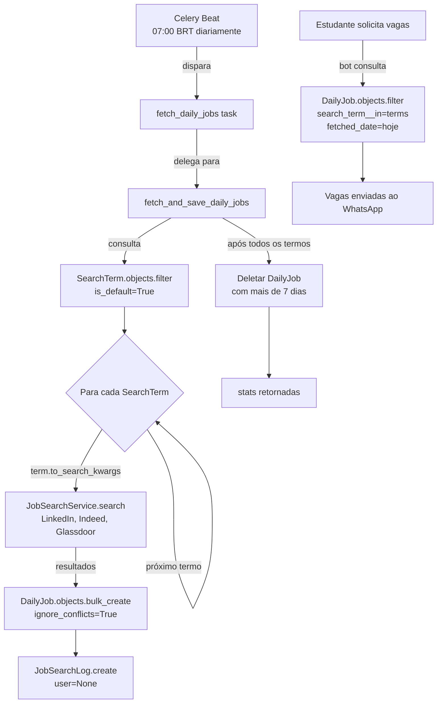
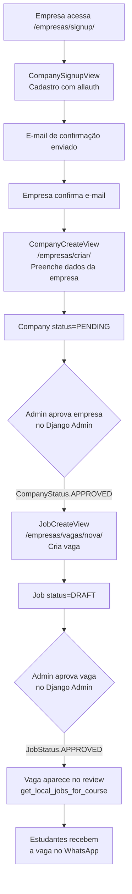

# Regras de Negócio — IterBot UTFPR

## 1. Quem Pode Usar o Bot

### Estudantes

- **Requisito:** e-mail institucional `@alunos.utfpr.edu.br` — validado por `validate_utfpr_email()` durante o fluxo de autenticação — `apps/users/validators.py`
- **Fluxo de acesso:** RA + senha do portal do aluno → e-mail institucional → link de confirmação enviado por e-mail → clique no link ativa `is_authenticated_utfpr=True` e `email_verified=True` no `UserProfile` — `apps/users/services.py:L87`
- **Token de confirmação:** expira em 24 horas — `apps/users/services.py:L82`
- **Re-login:** se e-mail já verificado anteriormente, autenticação com RA + senha autentica diretamente sem reenvio de link — `apps/users/services.py:L47`
- **Após autenticação:** acesso ao menu completo (busca de vagas, review semanal, trocar curso, logout)
- **Sem autenticação:** apenas opção de iniciar cadastro/login — `apps/bot/services.py:_handle_numeric_unauthenticated()` linha 203
- **Logout:** desliga apenas `is_authenticated_utfpr=False`; RA, e-mail e senha UTFPR são preservados para re-login sem nova verificação — `apps/users/services.py:L128`

### Empresas

- **Acesso:** exclusivamente via portal web `/empresas/` — NÃO pelo bot WhatsApp
- **E-mail:** aceita qualquer domínio de e-mail (não exige `@alunos.utfpr.edu.br`); `UTFPRAccountAdapter.clean_email()` verifica se a rota começa com `/empresas/` e libera a validação de domínio — `apps/users/adapters.py:L43`
- **Cadastro:** empresa cria conta → confirma e-mail via allauth → cria perfil de empresa (`Company`) — empresa fica com `CompanyStatus.PENDING`
- **Vagas:** criadas com `JobStatus.DRAFT` por padrão; ativas apenas após aprovação pelo administrador
- **Aprovação de empresa:** administrador aprova via Django Admin, alterando `company.status` para `CompanyStatus.APPROVED` — `apps/jobs/models/company.py:L40`

### Administradores

- Django Admin (`/admin/`) com `user.is_staff=True`
- Aprovam empresas (`CompanyStatus.APPROVED`) e vagas (`JobStatus.APPROVED`)
- Visualizam observabilidade: `BotActionLog`, `JobSearchLog`, `DailyJob`, métricas de negócio e técnicas
- Podem inserir vagas manuais na tabela `DailyJob` com `is_manual=True` sem scraping — `apps/jobs/models/daily_job.py:L26`
- Acesso protegido por BasicAuth (Traefik) + Django auth com `is_staff=True`

---

## 2. Como Vagas Chegam ao Banco (Pipeline DailyJob)

O bot **não** faz scraping em tempo real quando o estudante solicita vagas. Em vez disso, uma task Celery pré-fetcha todas as vagas diariamente e as persiste na tabela `DailyJob`. Quando o estudante busca vagas, o bot consulta o banco em milissegundos.

### Pipeline de Scraping

1. Celery Beat dispara `fetch_daily_jobs` todo dia às 07:00 horário de Brasília — `waha_bot/settings/celery.py:L29` (`crontab(hour=7, minute=0)`)
2. Task thin instancia `JobSearchService` e delega para `fetch_and_save_daily_jobs(job_searcher)` — função pura e testável — `apps/jobs/tasks.py:L27`
3. Itera sobre todos os `SearchTerm.objects.filter(is_default=True)` com `select_related("course")` — `apps/jobs/services.py:L145`
4. Para cada `SearchTerm`: usa `term.to_search_kwargs()` como fonte única de configuração e chama `job_searcher.search()` (LinkedIn, Indeed, Glassdoor via python-jobspy) — `apps/jobs/services.py:L154`
5. Somente resultados com URL válida são persistidos: `if r.get("job_url") or r.get("job_url_direct")` — `apps/jobs/services.py:L168`
6. Resultados salvos via `DailyJob.objects.bulk_create(to_create, ignore_conflicts=True)` — idempotente por `unique_together` — `apps/jobs/services.py:L171`
7. Vagas com mais de 7 dias são deletadas automaticamente no mesmo ciclo — `apps/jobs/services.py:L193`
8. Bot consulta `DailyJob.objects.filter(search_term__in=search_terms, fetched_date=hoje)` em milissegundos — `apps/bot/handlers/job_search.py:L354`
9. Fallback automático: se não há vagas para hoje (ex: antes das 07:00), busca a data mais recente disponível — `apps/bot/handlers/job_search.py:L363`

### Deduplicação

- `unique_together = [["search_term", "job_url", "fetched_date"]]` — re-execução da task no mesmo dia não duplica vagas — `apps/jobs/models/daily_job.py:L39`
- Dois índices compostos para queries sub-segundo: `[fetched_date, search_term]` e `[search_term, fetched_date]` — `apps/jobs/models/daily_job.py:L35`

### Vagas Manuais

- Campo `is_manual=True` na `DailyJob` permite inserção pelo administrador via Django Admin sem scraping — `apps/jobs/models/daily_job.py:L26`
- Vagas manuais aparecem nas buscas do bot da mesma forma que vagas scrapeadas

### Resiliência da Task

- `max_retries=3` e `default_retry_delay=300s` na task `fetch_daily_jobs` — `apps/jobs/tasks.py:L26`
- Falha em um `SearchTerm` individual não interrompe os demais — `apps/jobs/services.py:L183`

---

## 3. Como o Portal de Empresas Funciona

Empresas locais da região cadastram vagas diretamente no sistema via portal web Django. Vagas aprovadas aparecem no review semanal e no review sob demanda dos estudantes autenticados.

### Rotas do Portal (`/empresas/`)

Todas as rotas são montadas com o prefixo `/empresas/` em `waha_bot/urls.py` e definidas em `apps/companies/urls.py`:

| Rota | View | Descrição |
|------|------|-----------|
| `/empresas/signup/` | `CompanySignupView` | Cadastro de nova conta de empresa via allauth |
| `/empresas/login/` | `CompanyLoginView` | Login de empresa (redireciona para `/empresas/perfil/` após sucesso) |
| `/empresas/logout/` | `CompanyLogoutView` | Logout (redireciona para `/empresas/login/`) |
| `/empresas/criar/` | `CompanyCreateView` | Criação de perfil de empresa para usuário já autenticado |
| `/empresas/perfil/` | `CompanyProfileView` | Edição do perfil da empresa (exige login + empresa existente) |
| `/empresas/vagas/nova/` | `JobCreateView` | Criação de nova vaga (exige empresa aprovada) |
| `/empresas/vagas/<pk>/editar/` | `JobUpdateView` | Edição de vaga existente |
| `/empresas/vagas/<pk>/deletar/` | `JobDeleteView` | Remoção de vaga (soft delete) |

### Fluxo de Cadastro

1. Empresa acessa `/empresas/signup/` — `CompanySignupView` estende `allauth.account.views.SignupView` — `apps/companies/views.py:L17`
2. Cadastro com qualquer e-mail (o adapter libera a validação de domínio para rotas `/empresas/`) — `apps/users/adapters.py:L43`
3. allauth envia e-mail de confirmação via provider transacional configurado (`EMAIL_PROVIDER`)
4. Após confirmar o e-mail, empresa acessa `/empresas/criar/` — `CompanyCreateView` — `apps/companies/views.py:L78`
5. Preenche dados: CNPJ, razão social, e-mail de contato, telefone, endereço, responsável — `apps/jobs/models/company.py:L27`
6. `Company` criada com `status=CompanyStatus.PENDING` — aguarda aprovação do administrador
7. Administrador aprova via Django Admin, alterando `status` para `CompanyStatus.APPROVED` — `apps/jobs/models/company.py:L40`

### Criação e Aprovação de Vagas

1. Empresa acessa `/empresas/vagas/nova/` — `JobCreateView` — `apps/companies/views.py:L105`
2. `ApprovedCompanyRequiredMixin` bloqueia empresas com status diferente de `APPROVED` — `apps/companies/mixins.py`
3. Vaga criada com `status=JobStatus.DRAFT` por padrão — `apps/jobs/models/job.py:L37`
4. `CompaniesService.prepare_job_for_creation()` associa a vaga à empresa do usuário autenticado — `apps/companies/views.py:L115`
5. Administrador aprova a vaga no Django Admin, alterando `status` para `JobStatus.APPROVED`
6. Vagas `APPROVED` são incluídas no review via `get_local_jobs_for_course()` que filtra `Job.objects.filter(status=JobStatus.APPROVED)` — `apps/jobs/services.py:L39`

### Statuses de Vaga

| Status | Valor | Descrição |
|--------|-------|-----------|
| `DRAFT` | `"draft"` | Rascunho — criado pela empresa, não visível no review |
| `PENDING` | `"pending"` | Aguardando revisão do admin |
| `APPROVED` | `"approved"` | Aprovada — aparece no review de vagas dos estudantes |
| `REJECTED` | `"rejected"` | Rejeitada pelo admin (com motivo registrado) |
| `EXPIRED` | `"expired"` | Expirada por tempo |
| `REMOVED` | `"removed"` | Removida pela empresa (soft delete) |

---

## 4. Observabilidade e Logs (BotActionLog)

Cada interação significativa do bot gera um registro `BotActionLog`. O modelo é usado pelo Django Admin para exibir métricas de negócio e rastrear erros.

Referência: `apps/bot/models/bot_action_log.py:L7`

| `action_type` | Quando é criado |
|--------------|-----------------|
| `SEARCH` | Busca de vagas executada em `perform_search()` |
| `MENU` | Qualquer mensagem processada por `BotService.process_message()` (sucesso ou erro) — `apps/bot/services.py:L118` |
| `AUTH` | Fluxo de autenticação (login/logout) |
| `REVIEW` | Review de vagas enviado ao estudante |
| `WAHA_SEND` | Mensagem enviada via WAHA |

**Campos do modelo:**

| Campo | Tipo | Descrição |
|-------|------|-----------|
| `user` | FK nullable | Usuário que gerou a ação (null para tasks de background) |
| `action_type` | CharField | Uma das opções de `ACTION_CHOICES` |
| `search_term` | CharField nullable | Termo de busca (preenchido nas buscas) |
| `jobs_found` | IntegerField nullable | Quantidade de vagas retornadas |
| `duration_ms` | IntegerField nullable | Tempo de execução em milissegundos |
| `status` | CharField | `SUCCESS`, `ERROR` ou `TIMEOUT` |
| `error_type` | CharField nullable | `EXCEPTION`, `WAHA_TIMEOUT` ou `WAHA_SEND_FAIL` |
| `error_message` | TextField nullable | Mensagem de erro (sem dados sensíveis) |
| `metadata` | JSONField nullable | Dados adicionais arbitrários |

**Índices para queries de dashboard:**
- `(action_type, -created_at)` — filtro por tipo de ação
- `(status, -created_at)` — filtro por resultado
- `(user, -created_at)` — histórico por usuário

Todos definidos em `apps/bot/models/bot_action_log.py:L46`
