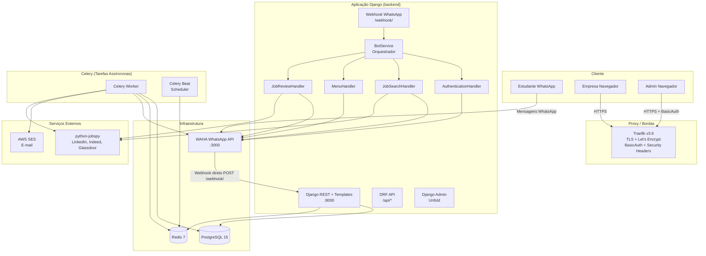

<!-- generated-by: gsd-doc-writer -->

# Visão Geral da Arquitetura — IterBot UTFPR

## Visão Geral do Sistema

O IterBot é um assistente WhatsApp que conecta estudantes da UTFPR a oportunidades de estágio e emprego. O sistema opera em duas frentes: (1) busca automática de vagas online via scraping (LinkedIn, Indeed, Glassdoor através do python-jobspy) e (2) vagas locais cadastradas por empresas da região por meio de um portal web. Estudantes interagem exclusivamente pelo WhatsApp — autenticam-se com credenciais do portal do aluno, seleccionam seu curso e recebem sugestões de vagas — enquanto empresas utilizam um portal web (Django + django-allauth) para cadastro e gestão de vagas. A arquitetura segue o padrão monolítico Django com filas assíncronas (Celery + Redis) para tarefas em background, integração com WhatsApp via WAHA (WhatsApp HTTP API), e proxy reverso (Traefik) com TLS e BasicAuth em produção.

## Diagrama de Componentes

## Fluxo de Dados

### 1. Fluxo principal: Estudante busca vagas pelo WhatsApp

1. O estudante envia uma mensagem pelo WhatsApp (ex: "3" para buscar vagas).
2. O WAHA recebe a mensagem e dispara um webhook POST para `/webhook/` no backend Django.
3. A view `webhook()` em `apps/bot/views.py` parseia o payload e delega para `BotService.process_message()`.
4. `BotService` recupera ou cria o `UserProfile` do usuário e identifica a intenção (comando global, ação pendente ou novo comando).
5. Se o fluxo é de busca de vagas, `JobSearchHandler` apresenta a lista de cursos cadastrados (`Course` → `SearchTerm`).
6. O estudante selecciona o curso e depois o termo de busca; `JobSearchHandler.perform_search()` invoca `JobSearchService.search()` que faz scraping via `python-jobspy`.
7. Os resultados são formatados e enviados de volta ao estudante via `WahaClient.send_message()`.
8. Cada mensagem recebida e enviada é registrada em `InteractionLog` no PostgreSQL.

### 2. Fluxo de autenticação de estudante

1. O estudante digita "1" ou "cadastrar" no WhatsApp.
2. `AuthenticationHandler` inicia o fluxo: RA → senha → e-mail institucional.
3. `UTFPRAuthService.authenticate()` valida as credenciais (atualmente placeholder, aceita qualquer RA exceto "000000").
4. `UTFPRAuthService.link_user()` cria/atualiza o `UserProfile` com RA, senha (criptografada via `EncryptedCharField`) e gera um token de confirmação de e-mail.
5. A task Celery `send_confirmation_email` envia um link de confirmação via AWS SES.
6. O estudante clica no link e `ConfirmEmailView` ativa `is_authenticated_utfpr = True`.
7. A partir desse momento, o estudante tem acesso completo ao bot (busca de vagas, review semanal).

### 3. Fluxo de cadastro de empresa (portal web)

1. A empresa acessa `/empresas/signup/` e cria uma conta com qualquer e-mail (django-allauth com `UTFPRAccountAdapter` libera domínio para empresas).
2. Após login, a empresa cadastra seus dados (`Company`) e cria vagas (`Job`) com status `PENDING`.
3. O administrador aprova a vaga via Django Admin, alterando o status para `APPROVED`.
4. Vagas aprovadas tornam-se visíveis no review semanal e buscas.

### 4. Fluxo de review semanal automático

1. Toda segunda-feira às 08:00 (horário de Brasília), o Celery Beat dispara a task `send_weekly_job_review`.
2. A task itera sobre todos os `UserProfile` com curso selecionado e telefone preenchido.
3. Para cada usuário, combina vagas locais aprovadas + vagas online via `python-jobspy`, deduplica e formata uma mensagem WhatsApp.
4. Cada mensagem é enviada via `WahaClient.send_message()` com intervalo de 1 segundo entre envios.

### 5. Fluxo de monitoramento de saúde do bot

1. A cada 5 minutos, o Celery Beat dispara `check_waha_health`.
2. A task consulta `GET /api/sessions/{session_name}` no WAHA e registra o resultado em `BotHealthCheck`.
3. Se duas verificações consecutivas falharem, o sistema tenta reconexão automática com backoff exponencial (30s, 60s, 120s) e envia alerta por e-mail via AWS SES. <!-- VERIFY: backoff durations are [30, 60, 120] seconds as defined in RECONNECT_BACKOFF -->

### 6. Fluxo de resposta da API REST (dashboard)

1. Requisições `/api/*` são roteadas pelo DRF Router para ViewSets (`CourseViewSet`, `UserProfileViewSet`, `SearchTermViewSet`, `InteractionLogViewSet`, `BotStatusViewSet`, `BotConfigurationViewSet`).
2. Todos os ViewSets exigem `IsAdminUser` — apenas usuários `is_staff=True` têm acesso. Requisições não autenticadas recebem HTTP 403.
3. `BotStatusViewSet` invoca `BotHealthMonitor` para retornar status atual e métricas agregadas (uptime, tempo de resposta médio, contagem de erros).
4. Serializers DRF convertem modelos para JSON com campos calculados (ex: `interactions_count`, `search_terms_count`).

## Abstrações Principais

| # | Abstração | Arquivo | Descrição |
|---|-----------|---------|-----------|
| 1 | `BaseHandler` | `apps/bot/handlers/base.py` | Classe abstrata base para handlers de conversação. Define `send_msg()`, `get_text()` e `handle()` — cada handler especializado (auth, busca, menu, review) herda desta classe. |
| 2 | `BotService` | `apps/bot/services.py` | Orquestrador central do bot. Recebe mensagens do webhook, identifica intenções e delega para o handler adequado conforme estado do usuário (`current_action`). |
| 3 | `WahaClient` | `infra/waha/client.py` | Cliente HTTP para a API do WAHA. Encapsula envio de mensagens (`send_message`), início de sessão (`start_session`) e normalização de chat IDs. |
| 4 | `JobSearchService` | `infra/jobs/service.py` | Serviço de busca de vagas online. Invoca `scrape_jobs` do python-jobspy para LinkedIn, Indeed e Glassdoor e retorna lista de dicts. |
| 5 | `UTFPRAuthService` | `apps/users/services.py` | Serviço de autenticação de estudantes. Métodos: `authenticate()`, `link_user()`, `confirm_email()`, `resend_confirmation()`, `logout()`. |
| 6 | `BotHealthMonitor` | `apps/bot/health.py` | Monitor de saúde do WAHA. Verifica status da sessão, calcula uptime/tempo de resposta e gerencia limpeza de registros antigos. |
| 7 | `TimeStampedModel` | `apps/core/models.py` | Modelo abstrato base com campos `created_at` e `updated_at`. Todos os modelos principais (`UserProfile`, `Company`, `Job`, `BotConfiguration`, etc.) herdam desta classe. |
| 8 | `EncryptedCharField` / `EncryptedTextField` | `infra/security/fields.py` | Campos de modelo Django que criptografam dados automaticamente no banco usando Fernet. Chave primária: Docker Secret `encryption_key` / env `ENCRYPTION_KEY`. Usa `MultiFernet` para retrocompatibilidade com dados cifrados pela chave legada (`SECRET_KEY`). |
| 9 | `AppConfig` | `config/env.py` | Dataclass central de configuração. Agrega `DjangoSettings`, `DatabaseSettings`, `RedisSettings`, `WahaSettings`, credenciais e e-mail. Lê de Docker Secrets → env vars → defaults. |
| 10 | `CorrelationIdMiddleware` / `StructuredLoggingMiddleware` | `infra/middleware/correlation_id.py`, `infra/middleware/structured_logging.py` | Middlewares de request que adicionam correlation ID e logging estruturado (JSON via structlog) a todas as requisições HTTP. |

## Racional da Estrutura de Diretórios

| Diretório | Descrição |
|-----------|-----------|
| `apps/` | Aplicações Django discretas, cada uma representando um domínio funcional (bot, jobs, companies, dashboard, users, courses, core). |
| `apps/bot/` | Lógica do bot WhatsApp: webhook view, serviço orquestrador, handlers de conversação, models de configuração/saúde/logs, tasks Celery e monitoramento. |
| `apps/bot/handlers/` | Handlers especializados de conversação separados por responsabilidade (auth, job_search, menu, job_review), seguindo o padrão Strategy com `BaseHandler` abstrato. |
| `apps/jobs/` | Modelos de domínio de vagas: `Company`, `Job`, `JobApplication`, `JobSearchLog`, validadores (CNPJ) e task de review semanal. |
| `apps/companies/` | Portal web para empresas: views baseadas em classe (signup, login, perfil, CRUD de vagas), forms, mixins de autorização e URLs. |
| `apps/dashboard/` | Dashboard admin + API REST pública (DRF ViewSets + Serializers) para cursos, termos de busca, usuários, interações, status e configuração do bot. |
| `apps/users/` | Model `UserProfile`, serviço de autenticação UTFPR, adapter django-allauth, validação de e-mail institucional, views de confirmação de e-mail e signals. |
| `apps/courses/` | Modelos `Course` e `SearchTerm` que conectam cursos da UTFPR a termos de busca para scraping. |
| `apps/core/` | Modelo abstrato `TimeStampedModel`, views de health check, `build_portal_url()` e admin customizado. |
| `infra/` | Infraestrutura transversal: cliente WAHA, serviço jobspy, campos criptografados, middlewares de correlation ID e logging estruturado, configuração do Traefik. |
| `infra/waha/` | `WahaClient` — cliente HTTP que encapsula toda comunicação com a API do WAHA. |
| `infra/jobspy/` | `JobSearchService` — fachada para o python-jobspy com busca multi-plataforma de vagas. |
| `infra/security/` | `FieldEncryption` (Fernet) e `EncryptedCharField`/`EncryptedTextField` para criptografia transparente de dados sensíveis no banco. |
| `infra/middleware/` | `CorrelationIdMiddleware` e `StructuredLoggingMiddleware` — middlewares Django para tracing distribuído e logs estruturados em JSON. |
| `infra/traefik/` | Configuração do Traefik: `traefik.yml` (dev), `traefik.prod.yml` (produção com redirect HTTPS), `dynamic/middlewares.yml` (security headers, rate limiting, BasicAuth). |
| `config/` | Configuração centralizada via `env.py` — dataclasses que leem de Docker Secrets → env vars → defaults. |
| `waha_bot/` | Projeto Django: `settings.py`, `urls.py` (roteamento raiz), `celery.py` (autodiscover), `asgi.py`/`wsgi.py`. |
| `docker/` | Dockerfiles multi-stage (`docker/django/Dockerfile`) e scripts de entrypoint/start. |
| `deployment/` | Scripts operacionais (setup EC2, backup/restore PostgreSQL, smoke check, harden security group, rollback) e configurações S3 lifecycle. |
| `secrets/` | Docker Secrets em arquivo (senhas, API keys, chaves) — **nunca** commitado no git. |